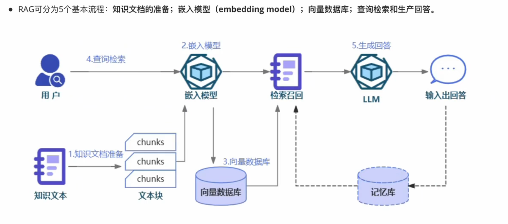

# 学习时候的一些疑惑


### 1. 写了model.eval() 为什么还要关闭梯度计算 with torch.no_grad()

某些层在训练和推理时的行为不同，model.eval()会修改这些层的内部状态：

Dropout 层：训练时随机丢弃神经元（防止过拟合），推理时保留所有神经元（输出确定值）。

BatchNorm 层：训练时使用当前批次的统计量（均值、方差），推理时使用全局统计量（已保存的 running_mean/running_var）。

RNN 层：部分 RNN 变体（如 LSTM）在训练时可能启用 dropout，推理时关闭。

总结：model.train() 和model.eval() 不影响模型变量积累梯度

### 2. metric = evaluate.load("glue", "mrpc") 怎么理解

metric = evaluate.load("glue", "mrpc") 并非加载数据集，而是加载与 GLUE 基准测试中 MRPC 任务相关的评估指标（Metric）是一组计算逻辑，用于衡量模型预测结果与真实标签的匹配程度（如计算predictions和references的准确率）。

加载 MRPC 任务的评估指标
GLUE：通用语言理解评估基准（General Language Understanding Evaluation），包含多个 NLP 任务（如 MRPC、MNLI 等）。
MRPC：微软研究释义语料库（Microsoft Research Paraphrase Corpus），任务为判断两个句子是否为释义（二分类任务）。
对应指标：MRPC 任务的官方评估指标是准确率（Accuracy）和F1 分数（F1-Score）。

### 3. range(num_training_steps) 返回的是range对象还是int整数

range(num_training_steps) 返回的是一个 range 对象，而非单个整数。

```python
num_training_steps = 5
r = range(num_training_steps)

print(type(r))        # 输出: <class 'range'>
print(list(r))        # 输出: [0, 1, 2, 3, 4]
print(r.start)        # 输出: 0
print(r.stop)         # 输出: 5
print(r.step)         # 输出: 1
```

### 4. epochs=3是遍历三遍训练集

### 5. adam和sgd区别

使用优化器来更新模型参数的时候，怎么更新是有说法的

sgd: 模型参数=当前参数- 学习率*一个batch积累的梯度

adam：根据参数的梯度历史动态调整每个参数的学习率

速度 vs 稳定性：Adam 适合快速迭代和探索，SGD 适合追求极致泛化能力。

默认选择：对于大多数深度学习任务，优先尝试 Adam 或 AdamW。

精细调优：若时间允许，SGD+Momentum 在某些任务上可能达到更好的最终性能。

### 6. PEFT LORA模型注意点

1. 调用get_peft_model（） 后，使用的基础模型结构是会被修改的，添加 LoRA 适配器层。
2. LORA微调的时候，如果指定了target_modules=["query", "key", "value", "classifier"]也就是lora作用的模块，如果不指定，LORA的trainer保存的时候保存的模块参数和作用的模块lora参数不一致，导致加载模型失败（没有合并lora和基础模型情况下分开加载）
3. LORA微调后一定要保存模型，合并保存！merged_model = model.merge_and_unload()

### 7. 字符分类任务总结


数据格式关键：id,token,ner_tags
数据还要有feature.names

分类的数据tokenize后，对应的ner_tags也要扩展

因此：也要DataCollatorForTokenClassification，能再对token扩展的同时也对labels拓展

验证，可以用evaluate的库加载seqeval

微调模型可以将模型替换为lora模型

然后开始torch手动或者trainer自动微调

### 8. 掩码类任务总结

加载数据：数据每个样本是个句子，一般的预处理方式是将所有句子连接起来然后切块，一个batch的所有句子连接起来，按照每个块128个字符切割成若干个样本

数据整理器data_collator（DataCollatorForLanguageModeling 需要mlm_probability 参数用来指定掩码比例）用来生成inputs中的掩码字符，labels则是复制原来一模一样的inputs，被遮掩的字符对应label的正确字符

不仅仅可以遮蔽单个 token，还可以一次遮蔽整个单词的所有 token，这种方法被称为全词屏蔽（whole word masking）

使用的时候正常用，在句子里添加 `[mask]`标识丢给模型即可

### 9. 计算loss的例子

logits = [2.3, -1.8]  # 积极类得分2.3，消极类得分-1.8

使用softmax 函数将 logits 转换为概率分布，y_true = [1, 0]  # 索引0表示积极，索引1表示消极

L=−(1⋅log(0.96)+0⋅log(0.04))≈0.041


### 10. 中文分词需要额外安装sentencepiece

MarianTokenizer需要安装SentencePiece库,SentencePiece 是一个开源的文本分词工具，专门用于处理多语言和无空格语言（如中文、日语）

MarianTokenizer（以及大多数基于 SentencePiece 的分词器）底层默认使用的是 BPE（Byte Pair Encoding）算法

### 11. 翻译任务总结

为什么需要有一个特定的 Trainer 子类来解决序列到序列问题？
因为序列到序列问题需要特殊的评估循环。序列到序列模型的预测通常需要使用 generate() 方法

1. 需要下载中日的句子对，对于中文这样的无空格分词，需要下载sentencePiece库，使用其中的MarianTokenizer

2. tokenizer可以查看和指定输入和目标语言，tokenizer.source_lang,tokenizer.target_lang

3. tokenize的时候传入两个：输入预言句子和text_target目标预言句子，才能输出input_ids,attention_mask和labels，否则没有labels

4. 编写tokenize的预处理函数就要提取一个batch的两种语言的句子，分别弄成inputs和text_target

5. 如果你正在使用 T5 模型（更具体地说，一个 t5-xxx checkpoint ），模型会期望文本输入有一个前缀指示目前的任务，比如 translate: English to French

6. data_collator必须要用DataCollatorForSeq2Seq，会在padding输入inputs和attention_mask的时候也自动padding对应的labels为-100，普通的data_collator不会填充labels，初始化datacollator的时候要传入tokenizer和model

7. 评估指标使用BLEU，但是一个句子可能有多种翻译方式，所以预测结果应该是一个句子列表，而参考应该是一个句子列表的列表

8. Trainer微调的时候用，Seq2SeqTrainingArguments,Seq2SeqTrainer，可以自动调用Generate方法生成句子而不是词表概率分布序列，能增强训练

9. BLEU计算的时候采用n_gram算法，目标如果没有空格间隔会被认为是一个gram，就没法计算了，我做是中文翻译日文的任务，翻译结果和目标label下载了mecab工具来分词

### 12. Jieba中文分词库

1. jieba 是基于词典和统计的分词工具，主要用于中文分词任务

2. Hugging Face 上的中文模型确实较少直接使用 jieba 库，通常使用基于子词（Subword）的分词器，分词器由模型开发者直接集成在 Tokenizer 中，无需额外依赖 jieba

### 13. 使用Trainer

1. 如果自己写了评估函数，trainer会在训练到评估时自动传入预测值和标签值

```python
trainer = Trainer(
    model,
    args,
    train_dataset=tokenized_datasets["train"],
    eval_dataset=tokenized_datasets["validation"],
    data_collator=data_collator,
    tokenizer=tokenizer,
    compute_metrics=compute_metrics,
)
def compute_metrics(eval_preds):
    preds, labels = eval_preds
```
### 14. 文本摘要任务总结

1. 也是使用seq2seq模型来做，加载数据集，每个样本都有两个字段：一段长文本和一段短文本，可以加载多国语言来增强模型能力，确保我们的模型不会过度拟合单一语言

2. mT5，这是一种基于 T5 的有趣架构，在文本到文本任务中进行了预训练。在 T5 中，每个 NLP 任务都是以任务前缀（如 summarize: ）的形式定义的，模型根据不同的任务生成不同的文本，这个模型采用了 Unigram 子词分词算法

3. 文本摘要评估使用ROUGE分数，ROUGE算法，召回率= 重叠词数量/参考摘要的总词数  召回率越高越好，精确度= 重叠词数量/生成摘要总次数，但是原生的对中文支持性很差，用了开源库rouge_chinese

4. 使用baseline用于和我们的进行对比

### 15. BN是在这个通道内的批次计算均值方差，而LN是单个样本的若干个通道的值做均值和方差

### 16. 网课

1. prefixed decoder，causal decoder
2. 语言建模（自回归预测），去噪自编码（类似掩码任务），混合去噪器
3. 涌现能力原因（评价指标不够平滑：精确匹配和多项选择。复杂任务和子任务）
4. scaling law
5. 幻觉，rouge，bleu，精确率，召回率，F1
6. RAG（知识文档准备，嵌入模型，向量数据库，查询检索和生产回答）


7. RAG检索评估：MRR，Hits rate
8. arxiv数据集怎么构建RAG库的，数据清洗，分块（NLTK库，固定大小分），Milvus库，model使用 all-MiniLM-L6-v2，库的索引配置相似度：指定L2（欧式距离）
9. embedding，模型嵌入，使用wrod2vect(静态向量)，bert（动态向量），嵌入模型排行榜，向量数据库的元数据（NER识别实体名，过滤元数据）
10. rag优化，多级索引，多级路由，向量索引/搜索算法：聚类，位置敏感哈希
11. 查询转换，llm结合对话历史和用户问题重新表述用户问题，假设文档嵌入
12. 检索参数，topk，相似度度量方法（欧式距离，jaccard距离，余弦相似度）
13. llm基于问题和文档进行回答，为了减少幻觉，提示词明确指出回答仅基于搜索结果
14. 高效微调：adapter，prefix tuning，lora，adalora，qlora
15. lora训练了一部分数据了，要训练另一部分数据（这个lora上继续（新旧数据相似），从头一个lora（怕以前知识干扰），base合并+一个lora（保留以前知识））
16. rank值选取，怎么避免过拟合（数据丰富度，减少r，weight_decay,dropout）
17. lora矩阵初始化
18. early stop(验证集性能不提升的时候停止训练)
19. 指数加权平均：对越临近的值权重越大，且只用额外保存一个值
    问题：序列小时初始的结果和真实值差别大；
    解决：使用系数修正

    梯度下降：梯度大的参数上容易震荡
    解决（动量）：使用历史梯度的指数加权平均
    RMSProp: 训练时有的梯度大，有的梯度小，也会导致训练不问题，对每个参数处于每个梯度平方的指数加权
    Adam：结合了动量和RMSProp
    Adam-w：增加了权重衰减（decay），每次更新参数后再减去一个很小的值，防止参数过大，提高泛化性
20. MoE（Mixture of Experts）是一种神经网络架构设计，其核心机制是让不同的子模型（专家）处理输入数据的不同部分，通过门控机制动态选择最优专家组合

21. vllm推理加速怎么实现，pageattention(传统的注意力计算要保留最大序列长度内存，比较浪费显存，pageattention利用类似内存分页技术，将key,value分割成块处理，显存占用可以减少四倍),内存池(预先申请大块显存，循环服用显存块)

22. QKV矩阵计算，`Q=X*W_q , K=X*W_k , V=X*W_v`，然后K按位相乘Q得到相似度，再在列上做softmax得到注意力分数

23. 模型评估，损失收敛，过拟合（验证集和独立验证集差别大），分类（准确率），生成（BLEU，ROUGE，人工评估）

1张3080 微调大概8个小时

### 因果语言建模总结

1. 目标是训练一个自动代码提示工具，采集数据集，来源自github的python代码相关的所有数据，筛选出来和科学相关的也有60w个样本
2. 数据很长，因为是代码！和掩码任务一样，要将数据截断，截断的数据也要返回，将一个样本切分成多个块，max_length设置为128，超过128的都分块，分了以后60w个样本暴增到1600w个样本，每个样本长128
3. 初始化一个全新的GPT-2-small 模型，120M个参数
```python
from transformers import AutoTokenizer, GPT2LMHeadModel, AutoConfig
config = AutoConfig.from_pretrained(
    "gpt2",
    vocab_size=len(tokenizer),
    n_ctx=context_length,
    bos_token_id=tokenizer.bos_token_id,
    eos_token_id=tokenizer.eos_token_id,
)
model = GPT2LMHeadModel(config)
```
4. 使用的数据整理器collator和掩码任务的一样（DataCollatorForLanguageModeling），掩码任务里用来生成mask标记，这里只要设置mlm=False就可以切换到CLM模式，会自动将label从inputs拷贝并且往后偏移一位，毕竟是自回归训练
5. 正常使用trainer进行训练就行了，使用trainer不用提供评估函数，默认对loss取指数作为困惑度e^loss，trainer内设置权重衰退weight_decay 防止过拟合 weight_decay本质是L2正则惩罚的系数 loss加上W^2，所以会学习更简单的参数，避免过拟合
6. pytorch手动控制训练：需要自己写评估函数取指数，可以自己写loss函数

### 问答系统总结

1. 下载和缓存数据集（含有context，question，answer有两部分（答案文本，答案的起始,结束位置））
2. 预处理数据：使用bert的tokenizer，question和context两个句子合在一起作为input_ids，tokenizer后会加入Cls,sep，但是有些示例的长度会很长，需要切块，切块的时候指定如下几个参数，切块后得到overflow_to_sample_mapping字段，每个值代表块对应的原始样本序号，从而将answer的起始结束位置修改成对应的块的位置。
3. 加载metric的squad规则
4. 使用的模型是AutoModelForQuestionAnswering.from_pretrainer('distilbert-base-cased-distilled-squad'),模型的预测结果是答案起始位置和结束位置的logits
5. 需要将答案映射回context中找到实际文字的答案
```python
inputs = tokenizer(
    question,  # 第一个句子
    context,   # 第二个句子
    max_length=100,
    truncation="only_second", # 只对第二个句子切块
    stride=50,                  # 切块后第一个块和第二个块有50个字符重叠
    return_overflowing_tokens=True, # 将超长文本切分成多个重叠片段，确保关键信息不被丢失。
    return_offsets_mapping=True, # 启用 return_offsets_mapping=True 后，offset_mapping 会包含每个 token 在原始 context 中的字符位置 会多一个字段overflow_to_sample_mapping，里面若干元素，每个值代表这个块对应的原始样本序号
)
切块的效果：
片段1：[CLS] Question (20 tokens) [SEP] C1-C80 [SEP] → 共 100 tokens
片段2：[CLS] Question (20 tokens) [SEP] C51-C130 [SEP] → 共 100 tokens（与片段1重叠50 tokens）
片段3：[CLS] Question (20 tokens) [SEP] C101-C180 [SEP] → 共 100 tokens（与片段2重叠50 tokens）
片段4：[CLS] Question (20 tokens) [SEP] C151-C200 [SEP] → 共 70 tokens（最后一个片段可能不足100）
```

## https原理

客户端和服务器建立连接

服务器发送自己的证书（数字签名+公钥）

客户端接收证书去CA验证，通过后使用证书提供的公钥加密和服务端约定一个通话秘钥用于对称加密

为什么中间人无法转发证书？证书的数字签名本质是CA的私钥加密md5的结果。CA公钥可以解密，里面包含了服务器域名等信息，中间人域名不对

# 我的项目

翻译任务，存在许多因法律体系、术语定义差异导致的专业名词翻译难点，比如：不当得利，抵押权（日本法律中「抵当権」特指不动产抵押），保证合同，我采集了一些司法领域的中日对照数据

数据采集：

数据预处理：

选择模型-翻译，摘要这些任务最好是采用seq2sq模型来做，我喜欢用T5做，因为他这个模型本身也是基于50多种语言预训练出来的，对中英文支持也不错，然后tokenizer对中日文分词也不错，就是在数据处理的时候，要对inputs加上任务指示提示词：translate chinese to japanese:inputs.

也用过赫尔辛基的一个支持中日文的模型，但是分词器做的比较差，需要我自己在compute_metric使用mecab工具将日文文本分词

然后选择评估工具，基本都采用BLEU来计算得分，


Xtuner和Vllm都是我之前学习大模型相关知识的时候学的，XTuner 是一个基于 PyTorch 和 Transformers 的开源框架，是专门用来做模型微调的

使用的话非常便捷，直接pip安装xtuner库，然后按照xtuner的格式组织数据，指令，输入，输出。
然后配置微调参数，可以指定基础模型，lora配置，训练配置，优化器配置，数据集
最后执行xtuner train 配置文件 就行了

VLLM是支持高并发的库，自带了服务器，可以直接启动配置端口。通过api访问大模型，高吞吐，内存效率高，--model指定模型，可以指定本地模型（只要是transformer格式的就行），可以支持类似flask的方式写post接口


指令生成代码微调实验：

EvolInstruct-Code-80k 数据集 100多MB，8w条数据，数据格式是（instructions指令,outputs生成内容和代码）

tokenizer QWenTokenizer，需要将数据格式转为 `[INST] 指令内容 [/INST] 代码响应内容`

DataCollatorForseq2seqLM

Qwen2.5-7B 的最大上下文长度：4096 tokens，而且对代码推理能力更好，试过分块，但是这个数据集一条样本所有数据总长度95%的数据长度都是小于3k的，为了减少训练负载选择直接filter掉大于2048长度的样本还剩6w样本，然后划分8000作为验证集，8000作为测试集

我的模型微调Qwen-7B,lora配置r=8,alpha=32,dropout=0.1,作用在q,v矩阵，使用int4,加载模型 load_in_8bit=True，样本长度平均在1000token吧
lr=2e-4 cosine调度,只需保存约 60-100MB 的 LoRA 参数,batch_size=16，2000步进行一次验证，

baseline在测试集的bleu是 bleu-4: 0.3817，微调后是 0.41

评估占用显存14G多一点，100个数据评估就花了1个多小时

1000个样本，大概跑了200小时

构建RAG和AGENT

1. langchain框架支持提示词模板绑定数据的方式，一个chain只需要LLM和模板就能组成一个单元，这样就可以让不同的大模型根据不同的模板来做不同的事，阅读模型可以根据用户和关键字来生成要做的代码生成指令，然后调用专门生成代码的大模型来推理和生成代码

2. 路由链可以决定使用哪个chain执行对应的任务，找不到合适的chain就使用默认的chain，要使用路由链也只要传递任务模板，和所有子链的列表

3. 解析器，可以指导大模型应该输出什么样的格式的结果，输出json的结果串就可以直接转为json对象，outputser可以直接转为字典，如果解析器生成结果出错了，可以调用修复解析器和重试解析器

4. 记忆管理，可以让llm自己做历史会话摘要

5. 可以定义工具，每个工具写好这个工具是做什么的，langchain会自动去调用

使⽤ EvolInstruct-Code-80k 作为训练和测试数据，基于 PEFT 库使⽤ Lora 对⼤语⾔模型进⾏低参数微调
，基于 BLEU-4 指标进⾏测试，得到能达到baseline水平的代码生成推理模型。基于模型，构建一个针对arXiv的知识问答
系统和论文创新点代码生成，用户通过给定入口进入系统咨询，寻找与问题相关的论文abstract，使用用户的请求对向量
数据库进行请求，寻找与问题最为相关的abstract，系统根据问题和论文abstract回答用户问题，并给出解答问题的信息
来源示例，生成主题相关的论文实践代码片段帮助用户了解相关赛道。
    很多时候用户给出的问题或陈述不一定能够匹配向量数据库的查询，构建大模型自动针对输入进行润色，提高找到对应
文档的概率，并增强结果反思判断代码和论文内容是否相符，自动判断已经获得准确的答案并停止迭代和如何再思路偏移
后进行修正。并且单次的生成结果可能无法寻找到用户所期望的答案，需要通过多轮的搜索和尝试才能获得较为准确的答
案，进行思路提示工程，将用户的需求拆解成逻辑步骤

技术挑战和优化方向：

构建rag的时候，向量化的只有论文摘要，论文的本体PDF是提前下载好的放在资产目录，也可以根据用户输入的名称获取，在获得合适论文的时候，根据题目用langchain的PyPDFLoader加载论文全文，构建langchainde 临时向量库，和向量化模型，根据相似度取得最接近用户问题的三个段落回答用户问题，用户也可以问文档相关的某个地方提供示例代码，再根据问题查询相关段落，结合成指令让代码模型生成示例代码

还可以再优化，做成能够自动根据用户关键字实时下载最新文档，自动调用爬虫下载其他会议的pdf文档

milvus返回的结果基本不为空，因为返回的是最接近的向量，应该手动控制相似度阈值，metrictype可以选择cosine，阈值0.5，然后返回为空应该提取关键字利用arxiv库下载最新论文

摘要与全文的关联性：确保摘要能够准确反映全文内容，否则可能导致检索到的摘要对应的全文与用户问题不相关。可以考虑在摘要中加入更多元数据（如关键词、作者、发表时间等）来提高关联性。
二次检索效率：当根据摘要找到相关论文后，再加载全文进行二次检索可能会引入延迟。可以考虑以下优化：
对全文进行预分段和预向量化，虽然不将全文向量存入主向量库，但可以为每个论文单独创建小型向量库，需要时快速加载。
使用更高效的文本检索算法（如 BM25）进行二次检索，而不是依赖向量相似度。
用户体验优化：在向用户展示结果时，可以同时提供摘要和相关段落的链接，让用户能够快速定位到原文

检索质量：如何平衡召回率与精度，处理长尾查询。
生成与检索的协同：联合训练检索器和生成器（如 Facebook 的原始 RAG 模型）以提升端到端效果。
效率优化：减少检索延迟（如使用近似最近邻搜索）、压缩生成模型规模。


